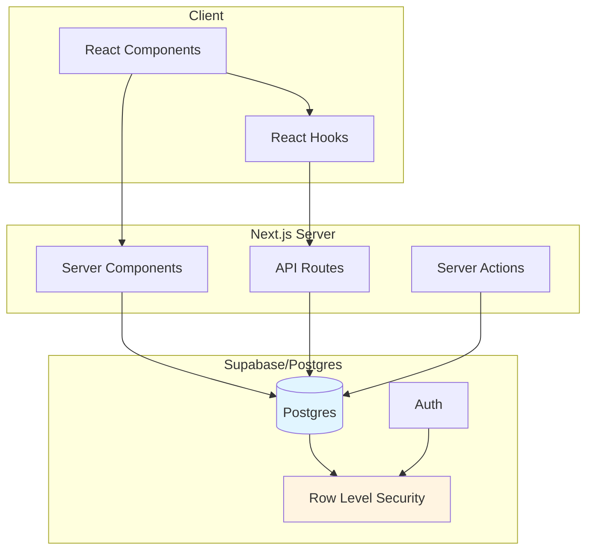

# Keel

A calm, household-level web application that helps parents replace spreadsheets used to track kids' activities, camps, schedules, and costs.

## Product Principles

- **Quietly essential** - Focused on core functionality without bloat
- **Calm, low-cognitive-load UI** - Simple, clear interfaces that reduce mental overhead
- **Household-first data model** - Data is organized around households, not individuals
- **Correctness over cleverness** - Reliable, predictable behavior is prioritized
- **Dates and timezones must never surprise the user** - Explicit, timezone-aware date handling

## Tech Stack

### Core
- **Next.js 14+** (App Router, React Server Components)
- **TypeScript**
- **Supabase** (Postgres, Auth, RLS)
- **Postgres** (primary data store)

### Libraries
- **UI**: React, Tailwind CSS
- **Forms & Validation**: react-hook-form, zod
- **Data fetching**: Supabase JS client
- **Dates & Timezones**: luxon (single source of truth)
- **State / async**: TanStack Query (client-only where needed)
- **Email**: Resend (future)
- **AI**: Vercel AI SDK (future, not implemented)

## Prerequisites

- Node.js 18+ and npm/pnpm/yarn
- Supabase CLI
- PostgreSQL (via Supabase local development)

## Local Development

### Initial Setup

1. Clone the repository
2. Install dependencies:
   ```bash
   cd apps/web
   npm install
   ```
3. Set up environment variables:
   ```bash
   cp .env.example .env.local
   # Edit .env.local with your Supabase credentials
   ```
4. Start Supabase locally:
   ```bash
   supabase start
   ```
5. Run database migrations:
   ```bash
   supabase db reset
   ```
6. Generate TypeScript types:
   ```bash
   npm run generate-types
   ```
7. Start the development server:
   ```bash
   cd apps/web
   npm run dev
   ```

### Environment Variables

See `.env.example` for required environment variables. Key variables include:

- `NEXT_PUBLIC_SUPABASE_URL` - Supabase project URL
- `NEXT_PUBLIC_SUPABASE_ANON_KEY` - Supabase anonymous key
- `SUPABASE_SERVICE_ROLE_KEY` - Service role key (server-side only)

## Architecture Overview



Keel follows a "thin API, fat database" architecture:

- **Server Components** perform direct Supabase queries for data fetching
- **API Routes** handle mutations and side effects
- **Row Level Security (RLS)** enforces authorization at the database level
- **Household** is the root boundary for all domain data

## Project Structure

```
schedule-tracker-core/
├── apps/
│   └── web/                 # Next.js application
│       ├── app/             # App Router routes
│       ├── components/      # React components
│       ├── lib/             # Utilities and helpers
│       ├── hooks/           # Custom React hooks
│       └── styles/          # Global styles
├── packages/
│   ├── shared/              # Shared types and validators
│   └── db/                  # Database migrations and policies
├── supabase/                # Supabase configuration
└── scripts/                 # Utility scripts
```

## Documentation

- [ARCHITECTURE.md](./ARCHITECTURE.md) - Detailed architecture and patterns
- [CONTRIBUTING.md](./CONTRIBUTING.md) - Development guidelines and conventions

## License

[To be determined]
